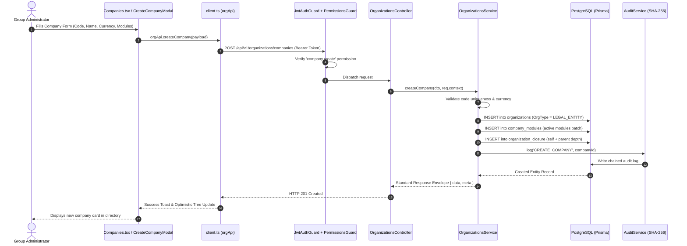
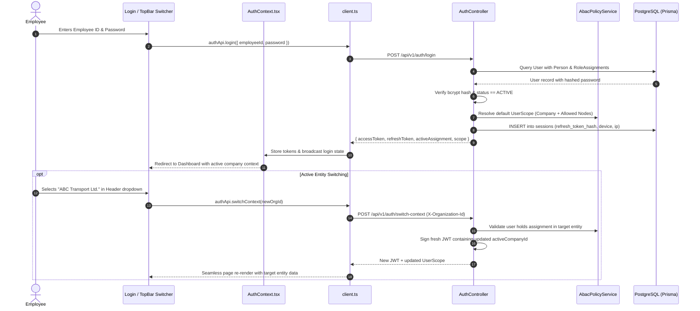
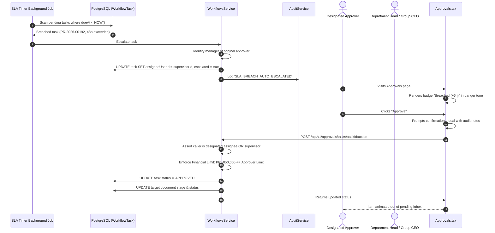
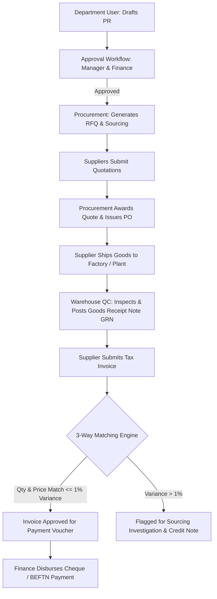
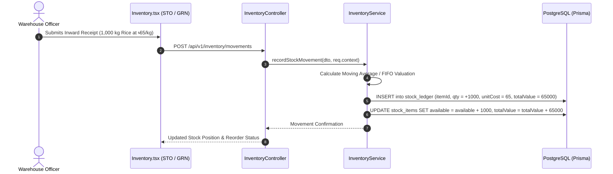
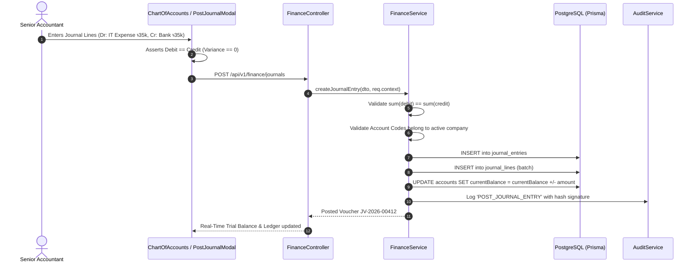
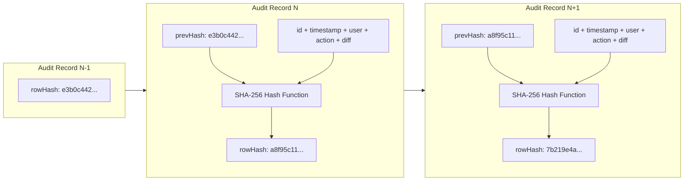
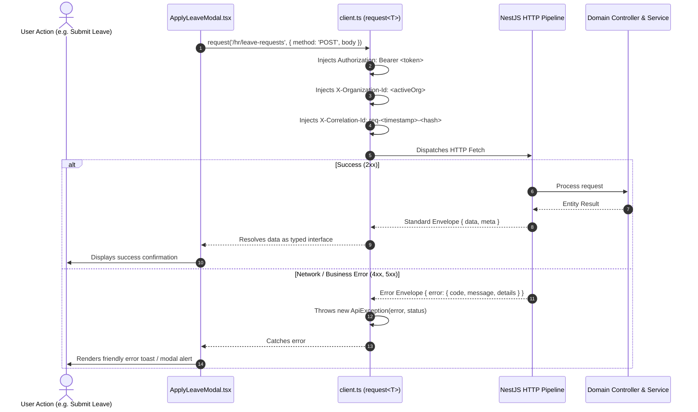

# Okobiz Enterprise ERP — GitHub Issues & Workflow Specifications
*Standardized Engineering Epics, System Flowcharts, API Contracts & Implementation Issues for Every ERP Domain*

> **Document Version:** 2.0.0  
> **Target Platform:** Okobiz Multi-Company Enterprise ERP (`backend/` & `design/`)  
> **Status:** Production Specification  

---

## Architecture Milestone Map

```
Epic 1: Organizations & Multi-Entity Hierarchy ───────────► [ORG-01]
Epic 2: Identity, IAM & Multi-Tenant Authentication ──────► [IAM-02]
Epic 3: HR & Employee Self-Service Workflows ─────────────► [HR-03]
Epic 4: Unified Multi-Domain Approval Engine ─────────────► [WF-04]
Epic 5: Procure-to-Pay (P2P) & 3-Way Matching ────────────► [PROC-05]
Epic 6: Inventory Ledger & Multi-Warehouse Movements ─────► [INV-06]
Epic 7: General Ledger & Double-Entry Accounting ────────► [FIN-07]
Epic 8: Cryptographic Audit Trail & Governance ───────────► [AUD-08]
Epic 9: Frontend-to-Backend State Synchronization ────────► [INT-09]
```

---

# SECTION 1: Organizations & Multi-Entity Hierarchy

## Issue #ORG-01: Multi-Level Organizational Tree, Legal Entities & Module Toggling

- **Labels:** `epic:organization`, `backend:module`, `frontend:ui`, `priority:critical`
- **Milestone:** Sprint 1 — Foundation
- **Target Backend Files:** 
  - `backend/src/modules/organizations/organizations.controller.ts`
  - `backend/src/modules/organizations/organizations.service.ts`
  - `backend/src/modules/organizations/dto/create-company.dto.ts`
  - `backend/src/modules/organizations/dto/create-node.dto.ts`
- **Target Frontend Files:** 
  - `design/src/pages/Companies.tsx`
  - `design/src/pages/OrgChart.tsx`
  - `design/src/components/organization/CreateCompanyModal.tsx`
  - `design/src/components/organization/ManageCompanyModal.tsx`
  - `design/src/components/organization/CreateOrgUnitModal.tsx`
  - `design/src/api/client.ts`

### 1. User Story
> **As a Group CEO / Super Administrator**, I want to model our group holding structure (Legal Entities &rarr; Business Units &rarr; Branch/Plants &rarr; Departments &rarr; Cost Centers) and enable or disable system modules per entity, so that corporate governance and data boundaries are structurally established across all sister companies.

### 2. End-to-End Workflow Diagram


### 3. Database Specification
- **Table:** `organizations`
  - `id`: UUID (Primary Key)
  - `parentId`: UUID (Nullable, foreign key to `organizations.id`)
  - `type`: Enum `OrgType` (`GROUP`, `LEGAL_ENTITY`, `BUSINESS_UNIT`, `BRANCH_PLANT`, `DEPARTMENT`, `COST_CENTER`)
  - `code`: VARCHAR(64) — Unique per parent
  - `name`: VARCHAR(255)
  - `path`: VARCHAR(255) — Materialized path (e.g. `/abc-group/abc-foods/`)
  - `currency`: VARCHAR(8) — Defaults to `BDT`
- **Table:** `company_modules`
  - `companyId`: UUID (Foreign Key)
  - `moduleKey`: VARCHAR(64) (`procurement`, `finance`, `inventory`, `hr`)
  - `status`: VARCHAR(16) (`ACTIVE`, `INACTIVE`)

### 4. Technical Implementation Steps
1. **Backend DTO & Validation**:
   - Implement `CreateCompanyDto` validating `code` (uppercase alphanumeric), `currency` (ISO-4217), and `modules` array.
2. **Backend Service (`organizations.service.ts`)**:
   - Wrap company creation, module initializations, and closure table entries in a Prisma interactive transaction (`this.prisma.$transaction`).
   - Implement closure table calculations to resolve subtree operations efficiently.
3. **Frontend API Client (`client.ts`)**:
   - Expose `orgApi.createCompany`, `orgApi.updateCompany`, and `orgApi.configureCompanyModules`.
4. **UI Wireup**:
   - Bind [CreateCompanyModal.tsx](file:///c:/Users/USER/Documents/Ridoy/ERP-System-Okobiz/design/src/components/organization/CreateCompanyModal.tsx) to call `orgApi.createCompany`.
   - Update [Companies.tsx](file:///c:/Users/USER/Documents/Ridoy/ERP-System-Okobiz/design/src/pages/Companies.tsx) to refresh list on creation.

### 5. Acceptance Criteria
- [ ] Only users with role level `GROUP` and permission `company.create` can create legal entities.
- [ ] Sub-units (departments, factories) cannot be created without a parent company.
- [ ] Disabling a module (e.g., `inventory`) for a company causes all related endpoints to return `403 Module Disabled for this Company`.
- [ ] Deletion of an entity with active child records is blocked with `ERR_HAS_DEPENDENT_CHILDREN`.

---

# SECTION 2: Identity, IAM & Authentication

## Issue #IAM-02: Multi-Entity Authentication, Active Scope Switching & ABAC Enforcement

- **Labels:** `epic:iam`, `backend:security`, `frontend:auth`, `priority:critical`
- **Milestone:** Sprint 1 — Security Foundation
- **Target Backend Files:** 
  - `backend/src/modules/auth/auth.controller.ts`
  - `backend/src/modules/auth/auth.service.ts`
  - `backend/src/modules/auth/services/abac-policy.service.ts`
  - `backend/src/modules/iam/iam.controller.ts`
  - `backend/src/modules/iam/iam.service.ts`
- **Target Frontend Files:** 
  - `design/src/contexts/AuthContext.tsx`
  - `design/src/pages/Login.tsx`
  - `design/src/pages/IAM.tsx`
  - `design/src/pages/Unauthorized.tsx`
  - `design/src/api/client.ts`

### 1. User Story
> **As an ERP User with multiple appointments** (e.g., Finance Manager at ABC Foods and Internal Auditor at Group level), I want to log in securely and switch between my active operating entities without logging out, while the system strictly restricts my visibility according to my active ABAC scope.

### 2. End-to-End Workflow Diagram


### 3. Database Specification
- **Table:** `users`
  - `employeeId`: VARCHAR(64) — Unique login identifier
  - `passwordHash`: VARCHAR(255) — Bcrypt with 12 rounds
  - `permissionsVersion`: INT — Incremented on role changes to instantly invalidate cached JWTs
  - `status`: VARCHAR(32) (`ACTIVE`, `SUSPENDED`, `INACTIVE`)
- **Table:** `user_role_assignments`
  - `userId`: UUID, `roleId`: UUID, `organizationId`: UUID, `companyId`: UUID (Nullable)
  - `scopeMode`: Enum `ScopeMode` (`SELF`, `NODE`, `SUBTREE`, `CROSS`)
  - `excludedOrgIds`: TEXT[] — Explicit department exemptions

### 4. Technical Implementation Steps
1. **ABAC Scope Assertion Helper (`abac-policy.service.ts`)**:
   ```typescript
   assertCompanyScope(scope: UserScope, resourceCompanyId: string, actionDesc: string): void {
     if (scope.level === 'GROUP' || scope.canApproveAnyCompany) return;
     if (!scope.allowedCompanyIds.includes(resourceCompanyId)) {
       throw new ForbiddenException({
         code: 'ERR_ABAC_COMPANY_ISOLATION',
         message: `Cross-company violation: Not authorized to ${actionDesc} in company ${resourceCompanyId}`
       });
     }
   }
   ```
2. **Context Switching (`auth.service.ts`)**:
   - Generate single-purpose JWT with claims `{ sub, employeeId, activeCompanyId, activeOrgNodeId, roleKey }`.
3. **Frontend Interceptor Integration**:
   - In `client.ts`, inject `X-Organization-Id` on all outbound requests from `localStorage.getItem('okobiz_erp_active_org')`.

### 5. Acceptance Criteria
- [ ] Attempting to read or write data of Company B while scoped to Company A returns `403 Forbidden` with error code `ERR_ABAC_COMPANY_ISOLATION`.
- [ ] The violation is logged in `AuditLog` with correlation ID and IP address.
- [ ] Frontend catches `ERR_ABAC_COMPANY_ISOLATION` and displays [Unauthorized.tsx](file:///c:/Users/USER/Documents/Ridoy/ERP-System-Okobiz/design/src/pages/Unauthorized.tsx).

---

# SECTION 3: Human Resources & Employee Workflows

## Issue #HR-03: Leave Lifecycle, Employee Reimbursements & Attendance Regularization

- **Labels:** `epic:hr`, `backend:workflows`, `frontend:hr`, `priority:high`
- **Milestone:** Sprint 2 — Workforce Operations
- **Target Backend Files:** 
  - `backend/src/modules/workflows/workflows.controller.ts`
  - `backend/src/modules/workflows/workflows.service.ts`
  - `backend/src/modules/iam/iam.service.ts`
- **Target Frontend Files:** 
  - `design/src/pages/HR.tsx`
  - `design/src/pages/MyWorkspace.tsx`
  - `design/src/components/hr/ApplyLeaveModal.tsx`
  - `design/src/components/hr/SubmitExpenseClaimModal.tsx`
  - `design/src/components/hr/RegularizeAttendanceModal.tsx`
  - `design/src/data/employeeWorkflows.ts`
  - `design/src/data/people.ts`

### 1. User Story
> **As an Employee**, I want to submit leave applications, claim out-of-pocket expenses with receipts, and regularize biometric punch discrepancies from My Workspace, so that my supervisor and HR can review and sign off with clear audit records.

### 2. End-to-End Workflow Diagram
```mermaid
sequenceDiagram
    autonumber
    actor Emp as Employee
    participant UI as MyWorkspace / ApplyLeaveModal
    participant State as employeeWorkflows.ts
    participant Inbox as operations.ts (getApprovalInbox)
    actor Mgr as Department Manager
    participant ApprUI as Approvals.tsx
    participant Audit as system.ts (recordAuditEvent)

    Emp->>UI: Selects Leave Type, Dates (18-24 Sep), Backup Person
    UI->>UI: Validates Leave Balance (Annual: 14 days available)
    UI->>State: createLeaveRequest(payload)
    State->>State: Generate LV-2026-0416, Status = 'pending'
    State->>Audit: Log 'SUBMIT_LEAVE_REQUEST'
    State-->>Inbox: Auto-notify Unified Approval Inbox subscribers
    UI-->>Emp: Shows "Leave Submitted" toast & updates My Requests

    Note over Inbox,ApprUI: Polymorphic projection appears in Manager's Inbox
    Mgr->>ApprUI: Opens Approvals &rarr; HR tab
    ApprUI->>Inbox: Reads leave_application-LV-2026-0416
    Mgr->>ApprUI: Clicks "Approve" with note "Handover verified"
    ApprUI->>State: decideLeaveRequest(id, 'approved', 'Karim Chowdhury', note)
    State->>State: Update status = 'approved', deduct quota balance
    State->>Audit: Log 'APPROVE_LEAVE_REQUEST'
    State-->>UI: Real-time update: employee calendar shows approved leave
```

### 3. Data Contracts
```typescript
export interface LeaveApplicationPayload {
  type: 'Annual Leave' | 'Sick Leave' | 'Casual Leave' | 'Unpaid Leave';
  from: string; // YYYY-MM-DD
  to: string;   // YYYY-MM-DD
  days: number;
  backupPerson: string;
  reason: string;
}

export interface ExpenseClaimPayload {
  title: string;
  category: 'Travel & Lodging' | 'Meals & Entertainment' | 'Office Supplies' | 'Client Meeting';
  amount: number;
  currency: 'BDT';
  expenseDate: string;
  costCenter: string;
  description: string;
  receiptName?: string;
}
```

### 4. Technical Implementation Steps
1. **Frontend Modal Wireup**:
   - Connect "Apply for leave" button in [HR.tsx](file:///c:/Users/USER/Documents/Ridoy/ERP-System-Okobiz/design/src/pages/HR.tsx) and [MyWorkspace.tsx](file:///c:/Users/USER/Documents/Ridoy/ERP-System-Okobiz/design/src/pages/MyWorkspace.tsx) to launch [ApplyLeaveModal.tsx](file:///c:/Users/USER/Documents/Ridoy/ERP-System-Okobiz/design/src/components/hr/ApplyLeaveModal.tsx).
   - Wire [SubmitExpenseClaimModal.tsx](file:///c:/Users/USER/Documents/Ridoy/ERP-System-Okobiz/design/src/components/hr/SubmitExpenseClaimModal.tsx) to append to `employeeWorkflows.ts`.
2. **Interactive Decisions**:
   - Provide live "Approve" and "Reject" handlers directly on the Leave table in `HR.tsx`.
3. **Backend Integration**:
   - Create NestJS endpoints `POST /api/v1/hr/leave-requests` and `POST /api/v1/hr/expense-claims` initiating corresponding `WorkflowInstance` records.

### 5. Acceptance Criteria
- [ ] Employees cannot request more leave days than their available quota balance.
- [ ] The applicant cannot approve their own leave or reimbursement request (Segregation of Duties).
- [ ] Approved leave automatically flags the employee as "On Leave" in daily attendance calculations.

---

# SECTION 4: Unified Approvals & Workflows Engine

## Issue #WF-04: Polymorphic Inbox, Matrix Routing & 48-Hour SLA Escalation

- **Labels:** `epic:workflow`, `backend:engine`, `frontend:approvals`, `priority:critical`
- **Milestone:** Sprint 3 — Core Governance
- **Target Backend Files:** 
  - `backend/src/modules/workflows/workflows.controller.ts`
  - `backend/src/modules/workflows/workflows.service.ts`
  - `backend/src/modules/workflows/dto/workflow-action.dto.ts`
- **Target Frontend Files:** 
  - `design/src/pages/Approvals.tsx`
  - `design/src/pages/ApprovalDetail.tsx`
  - `design/src/components/ApprovalDecisionModal.tsx`
  - `design/src/components/DelegationModal.tsx`
  - `design/src/data/operations.ts`

### 1. User Story
> **As an Approver (Manager, HOD, or CFO)**, I want a single unified inbox where all items needing my authorization (Purchase Requests, Invoices, Leaves, Expense Claims) are organized by domain with live SLA countdowns, so that approvals are processed swiftly without navigating across disconnected modules.

### 2. End-to-End Workflow Diagram


### 3. Business Logic & Security Assertions (`workflows.service.ts`)
```typescript
// 1. Segregation of Duties Check: Requester cannot approve
this.abacPolicy.assertSegregationOfDuties(callerUserId, document.requesterId, document.number);

// 2. Financial Authority Threshold
if (action === 'APPROVE') {
  this.abacPolicy.assertFinancialApprovalLimit(ctx.scope, Number(document.amount), document.number);
}

// 3. Company Boundary Isolation
this.abacPolicy.assertCompanyScope(ctx.scope, task.instance.companyId, 'action approval task');
```

### 4. Technical Implementation Steps
1. **Polymorphic Projector (`operations.ts`)**:
   - `getApprovalInbox()` projects underlying domain models (`PurchaseRequest`, `Invoice`, `LeaveRequest`, `ExpenseClaim`) into standard `ApprovalItem` objects.
2. **Bulk Authorization**:
   - Enable multi-select bulk approvals for low-risk items (`amount < ৳20,000` or `type === 'leave_application'`).
3. **Delegation Rules ("Acting for")**:
   - Allow users to set temporary delegations; any decision taken by the delegate explicitly notes: `Approved by X acting for Y`.

### 5. Acceptance Criteria
- [ ] Users cannot approve items outside their active company scope unless they hold `GROUP` executive privileges.
- [ ] If an item exceeds 48 hours without action, the SLA badge turns red (`Breached`) and the task re-assigns to the user's supervisor.
- [ ] Rejections require a mandatory comment explaining the reason.

---

# SECTION 5: Procure-to-Pay (P2P), Suppliers & 3-Way Matching

## Issue #PROC-05: Requisition, Purchase Order Lifecycle & Automated 3-Way Match

- **Labels:** `epic:procurement`, `backend:p2p`, `frontend:purchasing`, `priority:high`
- **Milestone:** Sprint 4 — Supply Chain
- **Target Backend Files:** 
  - `backend/src/modules/procurement/procurement.controller.ts`
  - `backend/src/modules/procurement/procurement.service.ts`
  - `backend/src/modules/procurement/dto/create-pr.dto.ts`
- **Target Frontend Files:** 
  - `design/src/pages/Procurement.tsx`
  - `design/src/pages/PurchaseRequests.tsx`
  - `design/src/data/operations.ts`

### 1. User Story
> **As a Procurement Officer / Sourcing Manager**, I want to submit purchase requisitions, compare supplier quotations, issue versioned Purchase Orders, and verify 3-way matching (PO vs. GRN vs. Invoice), so that company funds are safeguarded against price variances and phantom deliveries.

### 2. End-to-End Workflow Diagram


### 3. Database Specification
- **Table:** `purchase_requests`
  - `number`: VARCHAR(64) — Generated atomically (`PR-2026-XXXXX`)
  - `amount`: DECIMAL(19, 4)
  - `costCenterId`: UUID
  - `priority`: `LOW`, `NORMAL`, `HIGH`, `CRITICAL`
  - `status`: `PENDING`, `APPROVED`, `REJECTED`
- **Table:** `purchase_orders`
  - `number`: VARCHAR(64) (`PO-2026-XXXXX`)
  - `supplierId`: UUID (References `parties.id`)
  - `version`: INT (Increments upon contract amendments)
  - `status`: `DRAFT`, `ISSUED`, `PARTIALLY_RECEIVED`, `COMPLETED`, `CANCELLED`

### 4. Technical Implementation Steps
1. **Atomic Sequence Generation (`number-sequence.service.ts`)**:
   - Use PostgreSQL row-level lock (`SELECT ... FOR UPDATE`) to prevent duplicate document numbers during concurrent submissions.
2. **Automated 3-Way Match Logic (`procurement.service.ts`)**:
   - Compare `PO.lineTotal` vs `GRN.receivedQty * PO.unitPrice` vs `Invoice.totalAmount`.
   - If variance is within acceptable tolerance ($< 1\%$), mark invoice status `VERIFIED_READY_FOR_PAYMENT`.

### 5. Acceptance Criteria
- [ ] PO cannot be generated from an unapproved Purchase Request.
- [ ] Quantities received in GRN cannot exceed PO quantity by more than $5\%$ (over-delivery protection).
- [ ] Financial vouchers cannot be disbursed without a verified 3-way match.

---

# SECTION 6: Inventory Ledger & Multi-Warehouse Movements

## Issue #INV-06: Append-Only Stock Ledger, FIFO Valuation & Stock Transfer Orders

- **Labels:** `epic:inventory`, `backend:stock`, `frontend:warehouse`, `priority:high`
- **Milestone:** Sprint 5 — Logistics & Inventory
- **Target Backend Files:** 
  - `backend/src/modules/inventory/inventory.controller.ts`
  - `backend/src/modules/inventory/inventory.service.ts`
- **Target Frontend Files:** 
  - `design/src/pages/Inventory.tsx`
  - `design/src/data/operations.ts`

### 1. User Story
> **As a Warehouse Manager / Inventory Controller**, I want all physical receipts, dispatches, and inter-facility stock transfers to post to an immutable append-only stock ledger, so that inventory valuation is accurate and stock reconciliation is audit-proof.

### 2. End-to-End Workflow Diagram


### 3. Database Specification
- **Table:** `stock_items`
  - `sku`: VARCHAR(64) — Unique per company
  - `available`: DECIMAL(19, 4), `reserved`: DECIMAL(19, 4), `incoming`: DECIMAL(19, 4)
  - `reorderPoint`: DECIMAL(19, 4), `unitCost`: DECIMAL(19, 4)
- **Table:** `stock_ledger` (Append-Only)
  - `id`: UUID, `itemId`: UUID, `warehouseId`: UUID
  - `qty`: DECIMAL(19, 4) — Positive for inward, negative for outward
  - `unitCost`: DECIMAL(19, 4), `totalValue`: DECIMAL(19, 4)
  - `refModule`: VARCHAR(64) (`GRN`, `STO`, `DISPATCH`, `ADJUSTMENT`)
  - `postedAt`: TIMESTAMP (Default `NOW()`)

### 4. Technical Implementation Steps
1. **Immutable Double-Entry Ledger**:
   - Disallow `UPDATE` or `DELETE` on `stock_ledger` via PostgreSQL row-level triggers or Prisma service logic.
   - Any physical discrepancy must be resolved via a balancing `ADJUSTMENT` row with an audit reason.
2. **Reorder Alert Notifications**:
   - When `available <= reorderPoint`, flag item with status `LOW_STOCK` and suggest PR generation.

### 5. Acceptance Criteria
- [ ] No direct modification of `available` stock is permitted without a corresponding `stock_ledger` entry.
- [ ] Negative inventory is blocked unless explicit back-order override is granted by the Plant Manager.
- [ ] Stock valuations reconcile exactly with General Ledger Account 1300 (Inventory Asset).

---

# SECTION 7: General Ledger & Double-Entry Accounting

## Issue #FIN-07: General Ledger Engine, Balanced Journals & Inter-Company Mirroring

- **Labels:** `epic:finance`, `backend:gl`, `frontend:accounting`, `priority:critical`
- **Milestone:** Sprint 6 — Financial Core
- **Target Backend Files:** 
  - `backend/src/modules/finance/finance.controller.ts`
  - `backend/src/modules/finance/finance.service.ts`
  - `backend/src/modules/finance/dto/create-journal.dto.ts`
- **Target Frontend Files:** 
  - `design/src/pages/FinanceOverview.tsx`
  - `design/src/pages/ChartOfAccounts.tsx`
  - `design/src/pages/Invoices.tsx`
  - `design/src/pages/BankReconciliation.tsx`
  - `design/src/data/finance.ts`

### 1. User Story
> **As Chief Financial Officer / Chief Accountant**, I want all business transactions to translate into strictly balanced double-entry journal vouchers with real-time Chart of Accounts drilldown and automated inter-company mirrored entries, so that company and consolidated financial statements are immediately verifiable.

### 2. End-to-End Workflow Diagram


### 3. Business Logic: Strict Balance Validation
```typescript
const totalDebit = dto.lines.reduce((sum, l) => sum.add(new Decimal(l.debit || 0)), new Decimal(0));
const totalCredit = dto.lines.reduce((sum, l) => sum.add(new Decimal(l.credit || 0)), new Decimal(0));

if (!totalDebit.equals(totalCredit)) {
  throw new BadRequestException({
    code: 'ERR_UNBALANCED_JOURNAL',
    message: `Double-entry violation: Total Debit (৳${totalDebit}) must equal Total Credit (৳${totalCredit}). Variance: ৳${totalDebit.minus(totalCredit)}`
  });
}
```

### 4. Technical Implementation Steps
1. **Chart of Accounts (COA) Tree (`finance.service.ts`)**:
   - Provide 5-level hierarchical account rollup (Level 1: Category &rarr; Level 5: Sub-Ledger account).
2. **Inter-Company Mirrored Invoicing**:
   - When Entity A bills Entity B, automatically generate a mirrored pair:
     - Entity A: Debit Accounts Receivable (Due from Entity B), Credit Revenue.
     - Entity B: Debit Expense, Credit Accounts Payable (Due to Entity A).

### 5. Acceptance Criteria
- [ ] Journal entries with any debit/credit discrepancy return `400 Bad Request` (`ERR_UNBALANCED_JOURNAL`).
- [ ] Posted journal vouchers cannot be edited or deleted; corrections require an official Reversal Journal Voucher.
- [ ] Trial balance always reports $\sum Dr - \sum Cr = 0.00$.

---

# SECTION 8: Cryptographic Audit Trail & Platform Governance

## Issue #AUD-08: SHA-256 Tamper-Evident Hash Chaining & Integrity Verification

- **Labels:** `epic:audit`, `backend:security`, `frontend:compliance`, `priority:critical`
- **Milestone:** Sprint 7 — Security & Compliance
- **Target Backend Files:** 
  - `backend/src/modules/audit/audit.controller.ts`
  - `backend/src/modules/audit/audit.service.ts`
- **Target Frontend Files:** 
  - `design/src/pages/AuditLogs.tsx`
  - `design/src/data/system.ts`

### 1. User Story
> **As an Internal Auditor / Regulatory Compliance Officer**, I want every state mutation across the ERP to be recorded in a cryptographically chained audit log (SHA-256), so that any unauthorized database modifications or table tampering are immediately detectable.

### 2. Hash Chaining Flow Diagram


### 3. Cryptographic Algorithm (`audit.service.ts`)
```typescript
function computeRowHash(prevHash: string, entry: AuditLogEntry): string {
  const payload = [
    prevHash,
    entry.id,
    entry.occurredAt.toISOString(),
    entry.actorUserId || 'SYSTEM',
    entry.action,
    entry.resource,
    entry.resourceId || '',
    JSON.stringify(entry.newValue || {})
  ].join('|');

  return crypto.createHash('sha256').update(payload).digest('hex');
}
```

### 4. Technical Implementation Steps
1. **Verification Endpoint (`GET /api/v1/audit/verify`)**:
   - Re-computes hashes sequentially from the genesis record (`prevHash = '0000000000000000000000000000000000000000000000000000000000000000'`).
   - If any `rowHash` does not match, return `{ status: 'COMPROMISED', brokenRecordId: entry.id }`.
2. **Frontend UI Wireup**:
   - In [AuditLogs.tsx](file:///c:/Users/USER/Documents/Ridoy/ERP-System-Okobiz/design/src/pages/AuditLogs.tsx), provide a "Verify Cryptographic Chain" button displaying live validation status.

### 5. Acceptance Criteria
- [ ] Every mutation in `organizations`, `finance`, `procurement`, `workflows`, and `iam` generates an immutable audit record.
- [ ] Modifying any row directly in PostgreSQL breaks chain verification and pinpoints the corrupted entry.

---

# SECTION 9: Frontend-to-Backend State Synchronization

## Issue #INT-09: Centralized API Client, Reactive Subscriptions & Resilient Error Mapping

- **Labels:** `epic:integration`, `frontend:client`, `backend:gateway`, `priority:high`
- **Milestone:** Sprint 8 — Production Readiness
- **Target Backend Files:** 
  - `backend/src/common/interceptors/transform.interceptor.ts`
  - `backend/src/common/filters/http-exception.filter.ts`
- **Target Frontend Files:** 
  - `design/src/api/client.ts`
  - `design/src/contexts/AuthContext.tsx`
  - `design/src/contexts/EntityScopeContext.tsx`
  - `design/src/data/operations.ts`
  - `design/src/data/people.ts`
  - `design/src/data/employeeWorkflows.ts`

### 1. User Story
> **As a Frontend Developer**, I want a unified, typed API client that automatically handles token refresh, active context headers, correlation IDs, and unified error mapping, so that UI views seamlessly switch between mock state and real backend endpoints with complete type safety.

### 2. Request / Response Lifecycle


### 3. Implementation Checklist
- [ ] **Token Expiration Handling**: Intercept `401 Unauthorized` and trigger automatic silent token refresh via `/api/v1/auth/refresh`.
- [ ] **Reactive Event Bus**: When workflow tasks or leave requests are actioned, notify all subscriber components (`subscribeApprovalInbox`, `subscribeLeaveRequests`).
- [ ] **Vite Development Proxy**: Route `/api` calls to `http://localhost:3000` to eliminate CORS friction during development.
